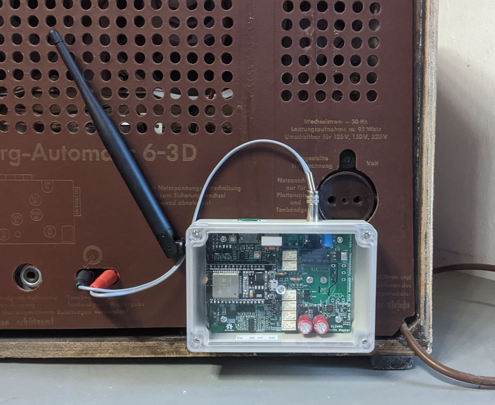

###Saba Webradio

Das Saba Webradio erweitert ein Saba Automatic Radio um die folgenden Funktionen:
- W-Lan Webradio
- Steuerung von Automatik und Lautst"arke per Webinterface, MQTT, IR Fernbedienung ...
- Steuerung des Webradio per Radio Automatiktasten

Es kann direkt auf die Anschlussbuchse für die Fernbedienung aufgesteckt werden. Kompatibel sind mind. das Meersburg und Freiburg 6-3D. Am Gerät selbst sind keine Modifikationen notwendig (aber empfehlen). Der Audioausgang des Webradio wird mit dem TA Eingang des Radios verbunden und kann durch Wahl des zugehörigen Eingangs am Radio verwendet werden.

Das Webradio basiert auf dem ESP32-Radio Projekt von Ed Smallenburg: https://github.com/Edzelf/ESP32-Radio.

[Hardware](https://github.com/martin-wagner/saba-6-3d-fernbedienung-hw)
[Software](https://github.com/martin-wagner/ESP32-Radio)

[Doku](doku/latex/doku.pdf)
